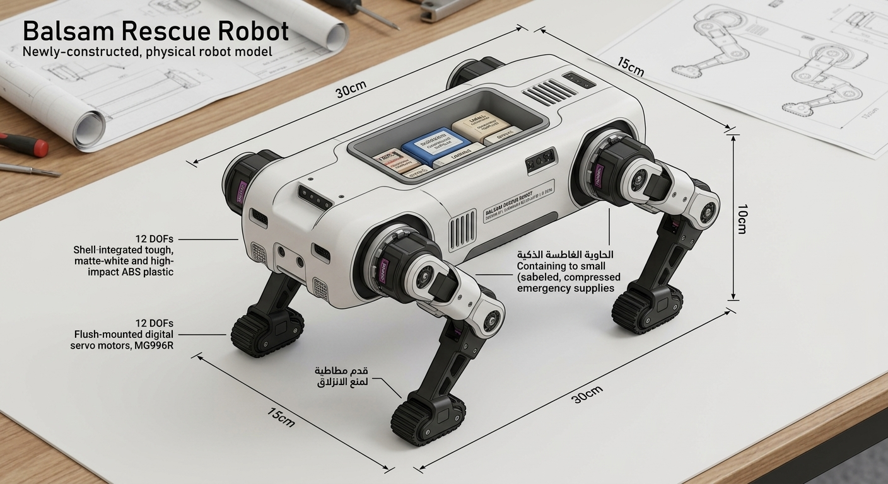
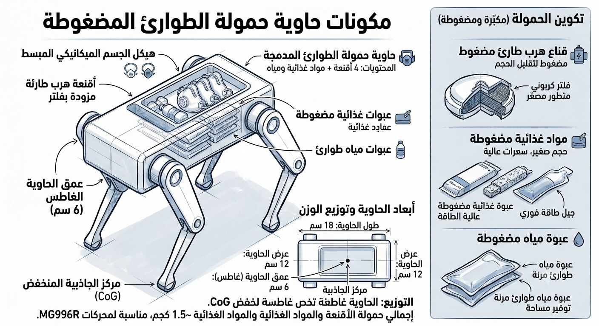
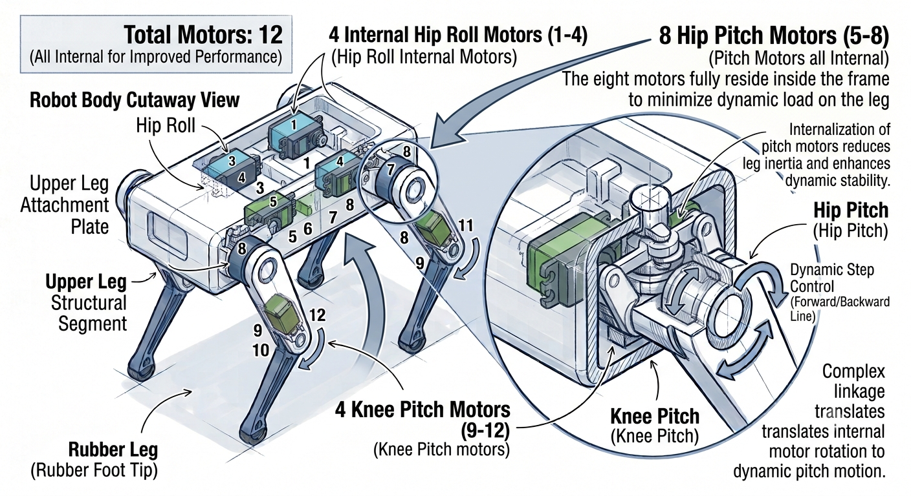
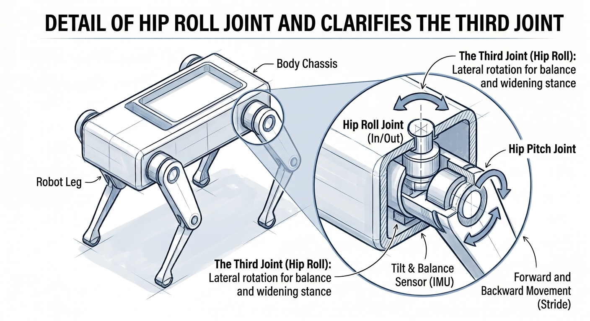

# Balsam Rescue Robot

## Initial Mechanical Design and Emergency Payload System for the Quadruped Rescue Robot "Balsam"

This project introduces an innovative technology that solves a big problem in rescue operations. Today, global research focuses on making search-and-explore robot dogs (like Boston Dynamics' **Spot**) to scan dangerous disaster zones. However, these current robots cannot give direct, immediate medical or food aid to injured people.

**Balsam** connects with these exploring robots using **shared Artificial Intelligence (AI)** and **Machine-to-Machine (M2M) communication**. The moment an exploring robot detects a person, it sends the exact location to Balsam. Balsam then quickly enters the area to deliver medical and food aid directly to the victim, keeping them alive until human rescue teams arrive.

### 🔗 Similarities and Key Differences (Balsam vs. Spot)
* **Similarity:** **Balsam** looks like **Spot** because it uses a **4-legged (quadruped) design** with **12 Degrees of Freedom (12 DOFs)** to walk over rough rocks and ruins easily.
* **Key Difference:** Spot is built just to scan, take pictures, and explore. **Balsam** is unique because it has a **smart built-in storage container with an automatic opening lid** to give real, life-saving help to trapped people.

---

## 1. Mechanical Structure & Storage Container Design

* **Body Shape and Frame:** A smooth, rectangular box chassis measuring ($30 \times 15 \times 10 \text{ cm}$). It is made of strong **ABS plastic**, which resists high heat and hard impacts during fires or building collapses.
* **Container Design and Automatic Lid:** There is a deep, built-in storage space in the middle of the robot's back measuring ($18 \times 12 \times 6 \text{ cm}$). **It has a smart lid that opens automatically using a servo motor when it reaches the injured person.** This deep design protects the medical supplies from fire, dust, and water, and keeps the Center of Gravity ($CoG$) low so the robot does not flip over.
* **Smart Lightweight Payload:** To keep the robot light, the container holds an emergency pack weighing only $1.5 \text{ kg}$. It includes:
    * **4 Flexible Emergency Escape Masks:** Vacuum-packed and light. They use carbon nano-filters to clean toxic Carbon Monoxide ($CO$) gas, giving the victim clean air for 30 minutes instead of carrying heavy oxygen tanks.
    * **Flexible Emergency Water Bags & Food Packs (Energy Gel):** Light in size and weight to stop dehydration and give quick energy.

---

## 2. Locomotion System & Torque Calculation

* **Leg Design & Degrees of Freedom (DOFs):** The robot has 4 identical legs. Each leg has 3 independent joints (Hip, Thigh, and Knee) making a total of **12 Degrees of Freedom (12 DOFs)**. This gives the robot high flexibility to climb over rubble.
* **Motor Selection & Distribution:** All 12 motors are the same type—**MG996R** high-torque digital servo motors with full metal gears (torque up to $15 \text{ kg.cm}$) to make programming easier. They are placed like this:
    * **8 External Motors:** Mounted on the legs (for the thigh and knee joints).
    * **4 Internal Motors:** Hidden inside the main box chassis, acting as a **"Mechanical Core"**. They control the side-to-side hip movement ($Hip Roll$) and widen the robot's legs automatically to keep balance based on M2M commands.

* **Initial Torque Calculation for One Joint:**
    * If the total weight of the robot with its payload is $W = 3 \text{ kg}$, and assuming the robot stands on at least 2 legs while walking, the force ($F$) on one leg is:
      $$F = \frac{W}{2} = \frac{3 \text{ kg}}{2} = 1.5 \text{ kg}$$
    * If the maximum length of the leg link is $L = 8 \text{ cm}$, the required torque ($\tau$) is:
      $$\tau = F \times L = 1.5 \text{ kg} \times 8 \text{ cm} = 12 \text{ kg.cm}$$
    * **Result:** The chosen motor ($15 \text{ kg.cm}$) easily covers the needed torque ($12 \text{ kg.cm}$), giving a great **Safety Factor** for the field.

---

## 3. AI Applications & M2M Technology (How AI is Used)

To make Balsam smart and autonomous, AI and M2M technology are used in three main areas:

1. **Shared Intelligence & M2M Communication:** Balsam talks directly to exploring robots using **Machine-to-Machine** protocols. The exploring robot acts as the "eyes" and Balsam acts as the "helping hand". The AI instantly reads the shared GPS coordinates to find the fastest, safest path to the victim.
2. **Self-Adapting Walk (AI Motion):** The 12 motors do not follow fixed, rigid code. Instead, an AI algorithm reads data from the **Inertial Measurement Unit (IMU)** sensor. If the robot steps on an unstable rock or a slope, the AI recalculates and changes the joint angles in milliseconds to stop it from falling.
3. **Smart Body Adjustment:** The 4 internal motors use smart AI timing to change how wide the robot stands based on how narrow or wide the paths are inside the ruins.

---

## 4. Stability, Mechanical Challenges, & Expected Field Obstacles

The mechanical design includes solutions for common problems in dangerous disaster environments:

* **Flipping and Balance Risks:** Solved by putting the storage space deep in the center and placing the batteries at the very bottom to lower the Center of Gravity ($CoG$). The robot also uses a **"Crawling Gait"** walk, moving only one leg at a time to stay steady.
* **Slipping on Wet Surfaces:** The bottom of the legs have textured rubber tips to increase friction and grip on slippery slopes.
* **Overheating Motors:** The body has side ventilation slots for airflow, and it uses aluminum brackets at the joint connections to pull heat away from the motors.
* **Weight vs. Battery Trade-off:** Running 12 motors with a $1.5 \text{ kg}$ payload uses a lot of energy, limiting work time to 20–30 minutes. To fix this, the robot uses high-discharge **LiPo batteries** and supports **Hot-Swapping** (quick battery changes) to return to work fast.

---

## 5. Intellectual Property & Originality Statement (IP Statement)

The Balsam robot is an original engineering concept developed independently. It is fully protected under intellectual property, authorship, and digital copyright laws belonging to the researcher. The project’s key novel features include:
* **Unique Functional Integration:** Designing a "4-legged medical rescue robot" that fixes the limits of current exploration-only robots, using M2M communication for instant first-aid.
* **Protected Recessed Container:** The spatial engineering design that embeds the storage compartment into the center of the body to lower the $CoG$ safely.
* **Mechanical Core Concept:** The smart use of 4 internal motors to change body width and balance independently from the legs.
* *Note: All CAD files, mechanical math, and motion codes are exclusively owned by the researcher.*

---

## 6. Use of AI Tools in Research and Design (Methodology)

Following academic honesty, generative AI tools were used as an engineering assistant during this project in these areas:

* **Concept Generation:** AI helped brainstorm lightweight payload options (like the vacuum-sealed nano-masks) and improve the M2M system idea.
* **Calculations Validation:** AI worked as a technical assistant to check the chassis size ($30 \times 15 \times 10 \text{ cm}$) against the weight ($3 \text{ kg}$), proving that the leg length ($8 \text{ cm}$) works perfectly with the chosen motor torque.
* **Visualization & Image Generation:** Text-to-Image AI tools were used to create 3D isometric engineering sketches, cross-section drawings, and leg joint layouts, clearly showing where the 12 internal and external motors go.
* **Technical Writing & Translation:** AI helped organize this technical report, improve the engineering terms, and translate the text accurately between Arabic and English to match professional standards.

---
***© 2026 Jumana Al-Shuaibi. All Rights Reserved.***
